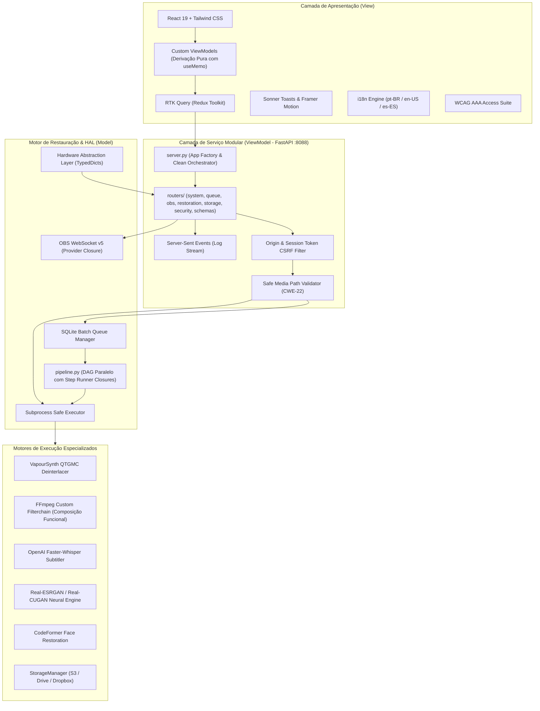

# 📼 VHS Studio Pro - Plataforma Avançada de Captura e Restauração Analógica

[](https://github.com/orgchrono/vhs-capture-scripts/actions/workflows/ci.yml)
[](logs/build_report.md)
[](swarm_audit_report.md)
[-brightgreen.svg)](docs/SECURITY.md)
[](docs/UI_UX_ACCESSIBILITY.md)
[](docs/COMPLIANCE_LICENSE.md)

O **VHS Studio Pro** é uma plataforma profissional de nível arquivístico e forense projetada para digitalização, restauração, estabilização temporal e aprimoramento por inteligência artificial de mídias analógicas magnéticas (**VHS, S-VHS, VHS-C, Video8, Hi8 e Betamax**).

Construído sob uma **Arquitetura DAG Paralela** (Grafo Direcionado Acíclico), o sistema orquestra a ingestão via OBS Studio (WebSocket v5), o desentrelaçamento de referência (QTGMC / VapourSynth), a remoção de ruídos (TBC frame-hold de software), a transcrição de áudio por IA (OpenAI Whisper), o upscaling de super-resolução (Real-ESRGAN x4plus) e o envio seguro para armazenamento local ou em nuvem (S3, Google Drive, Dropbox).

---

## 📑 Sumário

- [Visão Geral e Destaques](#-visão-geral-e-destaques)
- [Arquitetura do Sistema](#-arquitetura-do-sistema)
- [Níveis de Hardware (Tiers)](#-níveis-de-hardware-tiers)
- [Pipelines de Restauração](#-pipelines-de-restauração)
- [Interface Desktop & Web Pro](#-interface-desktop--web-pro)
- [Segurança & Privacidade](#-segurança--privacidade)
- [Compliance e Termos de Uso](#-compliance-e-termos-de-uso)
- [Quality Gates & CI/CD](#-quality-gates--cicd)
- [Instalação e Inicialização Rápida](#-instalação-e-inicialização-rápida)
- [Documentação Detalhada](#-documentação-detalhada)

---

## 🚀 Visão Geral e Destaques

- **Hardware Abstraction Layer (HAL):** Diagnóstico automático de CPU, RAM e detecção nativa de encoders por hardware (NVIDIA NVENC, AMD AMF, Intel QuickSync e Apple VideoToolbox).
- **TBC Frame-Hold Matemático:** Compensação temporal algorítmica para evitar descompasso cumulativo de áudio/vídeo (*A/V desync*) mesmo em fitas mofadas ou com perda periódica de sincronismo horizontal/vertical.
- **Desentrelaçamento Broadcast de Referência:** Integração com **VapourSynth + QTGMC** para reconstrução temporal de 60 campos/s para 60 frames/s progressivos fluidos, com fallback seguro para **bwdif** e **yadif**.
- **IA Multimodal Integrada:**
  - **Whisper AI:** Transcrição ponta a ponta e geração de legendas VTT/SRT em múltiplos idiomas.
  - **Real-ESRGAN x4plus:** Super-resolução neural treinada para restauração de texturas e eliminação de artefatos analógicos.
  - **PySceneDetect:** Detecção automática e catalogação de cenas e takes sem intervenção manual.
- **Fila Sequencial Persistente (Batch Queue):** Motor transacional SQLite com controle de prioridades, pausa/retomada e proteção contra sobrecarga de CPU/GPU.
- **Conectividade em Nuvem Segura:** Upload em segundo plano para AWS S3, Google Drive (OAuth2) e Dropbox com verificação de integridade BagIt e metadados de preservação.

---

## 🏛 Arquitetura do Sistema

O ecossistema implementa o padrão **MVVM Strict**, **Functional Core / Imperative Shell (FP Core)**, **Separação de Responsabilidades (SoC)** e **Fonte Única da Verdade (SSOT)**:



---

## 💻 Níveis de Hardware (Tiers)

O sistema analisa os recursos do hospedeiro e classifica o ambiente em três níveis honestos de desempenho:

| Nível | Classificação | Especificações Recomendadas | Modos Habilitados |
| :--- | :--- | :--- | :--- |
| **Tier 1** | **Broadcast AI Master** | 8+ Cores, 32GB+ RAM, NVIDIA RTX (8GB+ VRAM) | QTGMC Ultra-High, Real-ESRGAN x4plus, Whisper Medium/Large, NVENC Lossless |
| **Tier 2** | **High Quality Pro** | 6-8 Cores, 16GB RAM, GPU intermediária (GTX/AMD/Intel) | QTGMC Fast, bwdif, Whisper Small/Tiny, Encoders de Hardware |
| **Tier 3** | **Everyday Archive** | 4 Cores, 8GB RAM, CPU Integrada | bwdif / yadif, CPU x264 CRF 16, Whisper Tiny, Processamento Sequencial |

---

## 🎛 Pipelines de Restauração

O VHS Studio Pro inclui 4 perfis calibrados de restauração prontos para uso:

1. **Broadcast Archive (Máxima Fidelidade):** Desentrelaçamento QTGMC, filtragem de croma analógica, TBC de software, compressão ProRes / FFV1 / H.264 CRF 12.
2. **High Quality (Equilíbrio Produção):** Desentrelaçamento QTGMC modo rápido ou bwdif, denoise leve HQDN3D, áudio estéreo normalizado, H.264 CRF 16.
3. **Fast Everyday (Velocidade):** Desentrelaçamento bwdif de passagem única, encoder acelerado por GPU (NVENC/AMF/QSV), renderização em tempo real (1x–3x velocidade de fita).
4. **Custom Pipeline:** Controle granular de resolução (480p, 720p, 1080p, 4K), denoisers (HQDN3D, NLMeans), estabilização e modelos de IA.

---

## 🎨 Interface Desktop & Web Pro

A interface foi projetada seguindo as diretrizes mais avançadas de acessibilidade e experiência do usuário:

- **Sonner Toast System:** Notificações de feedback ricas, acessíveis, com suporte a ações e barra de progresso.
- **Framer Motion:** Transições fluidas e respeitosas com a preferência de redução de movimento do sistema (`prefers-reduced-motion`).
- **Acessibilidade WCAG 2.1 AAA:**
  - Navegação 100% realizável via teclado com anéis de foco visíveis (`focus-visible:ring-2`).
  - Marcação semântica com atributos ARIA (`aria-live`, `role="status"`, `aria-atomic`).
  - Contraste cromático estrito para operadores em salas escuras de edição.
- **Internacionalização (i18n):** Tradução instantânea sem recarregar a página para **Português (Brasil)**, **Inglês** e **Espanhol**.

---

## 🛡 Segurança & Privacidade

O VHS Studio Pro foi auditado e fortalecido contra as principais vulnerabilidades comuns em softwares de desktop híbridos:

- **Prevenção de Command Injection (CWE-78):** Todas as chamadas de subprocesso usam listas de argumentos sanitizadas (`shell=False`).
- **Prevenção de Path Traversal (CWE-22):** O validador canônico [`is_safe_media_path`](docs/SECURITY.md) bloqueia *null bytes* (`\0`), navegações relativas (`..`) e restringe acessos à pasta de trabalho autorizada.
- **Isolamento de Rede:** O servidor escuta exclusivamente em `127.0.0.1`, com verificação rigorosa de cabeçalhos `Host`, `Origin` e token de sessão CSRF dinâmico.
- **Privacidade Total:** **100% da computação é local.** Nenhum vídeo, frame, áudio ou metadado é transmitido para terceiros sem a configuração explícita e autenticada do usuário.

Para mais detalhes, consulte o documento completo: [**docs/SECURITY.md**](docs/SECURITY.md).

---

## 📜 Compliance e Termos de Uso

Inspirado no modelo de licença de softwares de preservação forense e ferramentas de baixo nível (como o *HDD Raw Copy Tool v2.6 License Agreement*):

1. **Concessão de Uso:** Software gratuito para uso pessoal, educacional, corporativo e forense.
2. **Redistribuição:** Livre distribuição permitida desde que em pacotes originais não modificados.
3. **Ausência de Garantias:** Fornecido no estado em que se encontra ("As Is").
4. **Limitação de Responsabilidade:** Isenção integral de danos ou perdas decorrentes do manuseio de fitas físicas frágeis.
5. **Responsabilidade do Operador:** O operador é o único responsável pela integridade da mídia física e verificação dos arquivos gerados.
6. **Execução Local:** Garantia de operação offline e privacidade de acervo.

Consulte o termo integral em: [**docs/COMPLIANCE_LICENSE.md**](docs/COMPLIANCE_LICENSE.md).

---

## 🚦 Quality Gates & CI/CD

A integridade do código é mantida através de **8 Quality Gates automatizados** executados concorrentemente antes de cada commit e em cada push no GitHub Actions:

```
[UI Linter (Oxlint / ESLint)]  ✅ PASSED
[Mypy (Python Types)]          ✅ PASSED
[Flake8 (Python Style)]        ✅ PASSED
[Anti-Plágio (JSCPD)]          ✅ PASSED
[Vitest (React Unit Tests)]    ✅ PASSED
[Playwright (E2E React)]       ✅ PASSED
[TSC (TypeScript Types)]       ✅ PASSED
[Pytest (Python Tests)]        ✅ PASSED
```

Para rodar todos os testes localmente:
```cmd
python scripts/lint.py
```

Para executar a auditoria profunda do enxame de arquitetura:
```cmd
python scripts/swarm_auditors.py
```

---

## ⚡ Instalação e Inicialização Rápida

### Pré-requisitos
- **Python 3.10 ou superior**
- **Node.js 18 ou superior**
- **FFmpeg** configurado no PATH ou na pasta `tools/ffmpeg/bin/`
- *(Opcional)* **OBS Studio** para captura ao vivo via placa de captura

### Inicialização com Um Clique (Windows)
Basta clicar duas vezes ou executar no terminal:
```cmd
run.cmd
```
*O script verificará as dependências, compilará o frontend React automaticamente se necessário e abrirá a janela do aplicativo nativo Desktop Pro.*

### Inicialização no Linux / macOS
```bash
chmod +x run.sh
./run.sh
```

### Inicialização Manual via Linha de Comando
```bash
# Instalar dependências Python
pip install -e .

# Instalar dependências da UI
cd ui && npm ci && cd ..

# Iniciar o modo Desktop Pro
vhs-studio desktop
```

---

## 📚 Documentação Detalhada

Para guias aprofundados sobre cada módulo do sistema, explore a pasta [`docs/`](docs/):

- 📐 [**Arquitetura do Sistema (`docs/ARCHITECTURE.md`)**](docs/ARCHITECTURE.md): Modelos MVVM, HAL, concorrência e padrões de projeto.
- 🔌 [**Referência Completa da API REST & SSE (`docs/API_REFERENCE.md`)**](docs/API_REFERENCE.md): Contratos, payloads e schemas dos endpoints.
- 🔒 [**Manual de Segurança e Modelo de Ameaças (`docs/SECURITY.md`)**](docs/SECURITY.md): Mitigações CWE, políticas e auditoria.
- ⚖️ [**Termos de Compliance e Licença (`docs/COMPLIANCE_LICENSE.md`)**](docs/COMPLIANCE_LICENSE.md): Acordo legal de uso e responsabilidade.
- 🎞️ [**Guia Prático da Pipeline de Restauração (`docs/PIPELINE_GUIDE.md`)**](docs/PIPELINE_GUIDE.md): QTGMC, Whisper AI, denoisers e presets.
- ♿ [**Design System, A11y e i18n (`docs/UI_UX_ACCESSIBILITY.md`)**](docs/UI_UX_ACCESSIBILITY.md): Acessibilidade WCAG 2.1 AAA e localização.
- 📹 [**Guia de Captura no OBS Studio (`docs/OBS_GUIDE.md`)**](docs/OBS_GUIDE.md): Calibração de dispositivos e fontes.
- 🛠️ [**Guia de Contribuição (`docs/CONTRIBUTING.md`)**](docs/CONTRIBUTING.md): Padrões de código, branches e hooks.