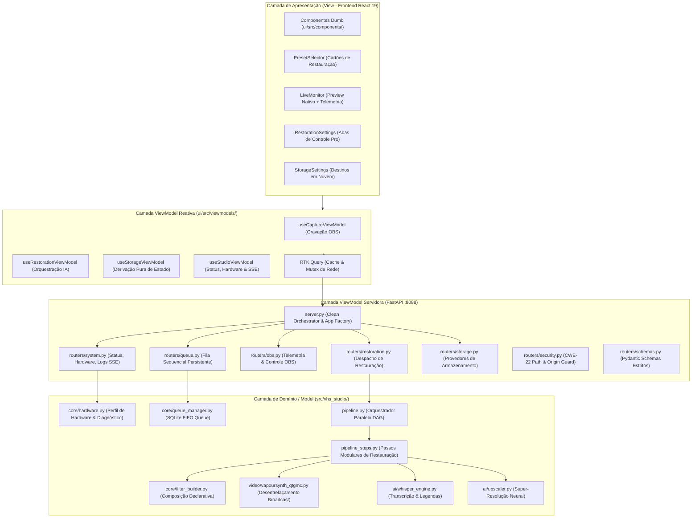
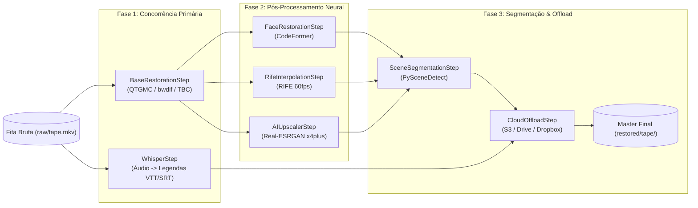

# 📐 Arquitetura do Sistema - VHS Studio Pro

Este documento descreve detalhadamente os padrões arquiteturais, a divisão de camadas, o fluxo de dados, a organização modular e os princípios funcionais aplicados no **VHS Studio Pro**.

---

## 1. Princípios Fundamentais

A arquitetura do VHS Studio Pro foi concebida para atender a requisitos rigorosos de preservação histórica, estabilidade operacional e manutenibilidade pública no GitHub:

1. **Separação de Preocupações (Separation of Concerns - SoC):** A interface de usuário (View), os orquestradores de estado e roteadores (ViewModel) e os motores de domínio (Model) são desacoplados em módulos específicos e testáveis isoladamente.
2. **Princípio da Responsabilidade Única (Single Responsibility Principle - SRP):** Cada módulo possui um propósito delimitado. O servidor de API não implementa manipulação de vídeo direta; os roteadores apenas validam esquemas e despacham; filtros do FFmpeg são construídos por geradores puros; detecção de hardware apenas inspeciona o hospedeiro.
3. **Fonte Única da Verdade (Single Source of Truth - SSOT):** Configurações globais e presets residem em arquivos canônicos:
   - `pyproject.toml` (dependências Python, linters e metadados PEP 621)
   - `package.json` (dependências, scripts e tooling da UI)
   - `vhs_advanced_config.toml` (presets e parâmetros canônicos do motor analógico)
4. **Isolamento de Falhas (Fail-Safe Process Execution):** Motores externos pesados (FFmpeg, VapourSynth, Whisper, Real-ESRGAN, CodeFormer) executam em processos isolados gerenciados pelo `ProcessManager`. Qualquer exceção de driver ou travamento de hardware não afeta a API nem a interface gráfica.
5. **Functional Core / Imperative Shell (FP Core):**
   - O núcleo do sistema é modelado com funções puras e closures idiomáticas sem efeitos colaterais (`make_step_runner`, `make_origin_verifier`, `make_obs_client_provider`, `resolve_deinterlace_filter`, `resolve_codec_video_args`).
   - Mutações de estado compartilhado (`global`) foram 100% eliminadas do projeto.
   - Tipos frouxos (`Any` / `any`) foram substituídos por `TypedDict`, contratos canônicos e interfaces tipadas no Python e no TypeScript.

---

## 2. Camadas da Aplicação (MVVM Strict)



---

## 3. Decomposição Modular da API (routers/)

O arquivo monolítico anterior `server.py` (528 linhas) foi decomposto em sub-módulos coesos em `src/vhs_studio/api/routers/`:

| Módulo | Responsabilidade | Endpoints Principais |
| :--- | :--- | :--- |
| **[`system.py`](file:///c:/Users/danie/Documents/vhs-capture-scripts-main/src/vhs_studio/api/routers/system.py)** | Verificação de integridade, telemetria do hospedeiro e streaming reativo | `GET /api/token`<br>`GET /api/status`<br>`GET /api/hardware`<br>`GET /api/logs`<br>`GET /api/logs/stream` (SSE) |
| **[`queue.py`](file:///c:/Users/danie/Documents/vhs-capture-scripts-main/src/vhs_studio/api/routers/queue.py)** | Gerenciamento transacional da fila persistente em lote | `GET /api/queue`<br>`POST /api/queue/enqueue`<br>`POST /api/queue/cancel/{id}`<br>`POST /api/queue/start`<br>`POST /api/queue/stop` |
| **[`obs.py`](file:///c:/Users/danie/Documents/vhs-capture-scripts-main/src/vhs_studio/api/routers/obs.py)** | Integração via WebSocket v5 com OBS Studio | `GET /api/obs/stats`<br>`POST /api/obs/start`<br>`POST /api/obs/stop`<br>`POST /api/obs/virtualcam` |
| **[`restoration.py`](file:///c:/Users/danie/Documents/vhs-capture-scripts-main/src/vhs_studio/api/routers/restoration.py)** | Disparo de pipelines de restauração e instaladores automatizados | `POST /api/run`<br>`POST /api/action`<br>`POST /api/install_qtgmc` |
| **[`storage.py`](file:///c:/Users/danie/Documents/vhs-capture-scripts-main/src/vhs_studio/api/routers/storage.py)** | Configuração e validação de storage local e nuvem | `GET /api/storage/config`<br>`POST /api/storage/config` |
| **[`security.py`](file:///c:/Users/danie/Documents/vhs-capture-scripts-main/src/vhs_studio/api/routers/security.py)** | Proteção contra path traversal (CWE-22) e origin middleware | `is_safe_media_path`<br>`make_origin_verifier`<br>`SESSION_TOKEN` |
| **[`schemas.py`](file:///c:/Users/danie/Documents/vhs-capture-scripts-main/src/vhs_studio/api/routers/schemas.py)** | Modelos Pydantic para validação de entrada estrita | `StorageConfigPayload`<br>`QueueEnqueuePayload`<br>`ActionPayload`<br>`ObsVirtualCamPayload` |
| **[`server.py`](file:///c:/Users/danie/Documents/vhs-capture-scripts-main/src/vhs_studio/api/server.py)** | Application factory enxuta (84 linhas) e orquestrador de routers | `create_app()`<br>`run_server()` |

---

## 4. Arquitetura DAG da Pipeline de Restauração

O orquestrador [`PipelineOrchestrator`](file:///c:/Users/danie/Documents/vhs-capture-scripts-main/src/vhs_studio/pipeline.py#L40) executa tarefas através de um Grafo Direcionado Acíclico (DAG) com concorrência ótima:



### Isolamento de Passos com Closures
Cada passo pós-processamento utiliza a closure funcional [`make_step_runner`](file:///c:/Users/danie/Documents/vhs-capture-scripts-main/src/vhs_studio/pipeline.py#L27):
```python
def make_step_runner(step_name: str, fn: Callable[[], Optional[str]]) -> Callable[[], Optional[str]]:
    """Closure capturing pipeline step execution with uniform logging and error boundaries."""
    def run() -> Optional[str]:
        try:
            res = fn()
            log.info(f"[{step_name.upper()}] Step completed successfully.")
            return res
        except Exception as exc:
            log.error(f"[{step_name.upper()} ERROR] Step failed: {exc}")
            return None
    return run
```
Essa abordagem garante que uma falha opcional (como CodeFormer sem modelo baixado) não comprometa a entrega do arquivo restaurado principal nem gere corrupção de estado.

---

## 5. Frontend Reativo & Pureza Funcional

O frontend em `ui/src/` segue estritamente as diretrizes modernas do React 19:

1. **Eliminação de Loops de Sincronização (`useEffect`):**
   - No [`useStorageViewModel.ts`](file:///c:/Users/danie/Documents/vhs-capture-scripts-main/ui/src/viewmodels/useStorageViewModel.ts), o estado de configuração é derivado puramente via `useMemo` combinando a configuração padrão, a resposta remota do RTK Query e as modificações ativas do usuário.
   - No [`PrivacyModal.tsx`](file:///c:/Users/danie/Documents/vhs-capture-scripts-main/ui/src/components/PrivacyModal.tsx), a abertura inicial do EULA é computada na inicialização preguiçosa de estado (`useState(() => !localStorage.getItem(...))`), eliminando renderizações em cascata.
2. **Utilidades Puras & Type-Guards:**
   - [`ui/src/lib/errors.ts`](file:///c:/Users/danie/Documents/vhs-capture-scripts-main/ui/src/lib/errors.ts): Função pura [`getErrorMessage`](file:///c:/Users/danie/Documents/vhs-capture-scripts-main/ui/src/lib/errors.ts#L5-L19) para extração segura de mensagens a partir de `unknown`.
   - [`ui/src/lib/formatters.ts`](file:///c:/Users/danie/Documents/vhs-capture-scripts-main/ui/src/lib/formatters.ts): Formatadores puros de telemetria sem efeitos colaterais (`formatBytes`, `formatBitrate`, `formatDuration`).
3. **Zero `any`:**
   - Todo o código TypeScript opera sob verificação estrita (`strict: true`), garantindo que nenhum tipo frouxo ou coerção cega entre em produção.

---

## 6. Qualidade de Código & Verificação Contínua

A codebase é continuamente validada por dois sistemas integrados:

1. **Pre-Commit Hook dos 8 Quality Gates (`scripts/lint.py`):**
   - Oxlint (Frontend linter de alta velocidade)
   - Mypy (Typechecker estrito para Python)
   - Flake8 (Conformidade com PEP 8)
   - JSCPD (Detecção de duplicação de código)
   - Vitest (Testes unitários da UI React)
   - Playwright (Testes de integração E2E)
   - TSC (`tsc --noEmit` para TypeScript)
   - Pytest (83 testes unitários e de integração Python)
2. **Swarm Auditors (`scripts/swarm_auditors.py`):**
   - 7 auditores especializados executados em paralelo cobrindo Arquitetura (SoC/SRP), CI/CD, Test Harness, UX/UI & a11y, Segurança, Dependências e Melhores Práticas FP Pure (zero globals, zero Anys, zero TODOs).
