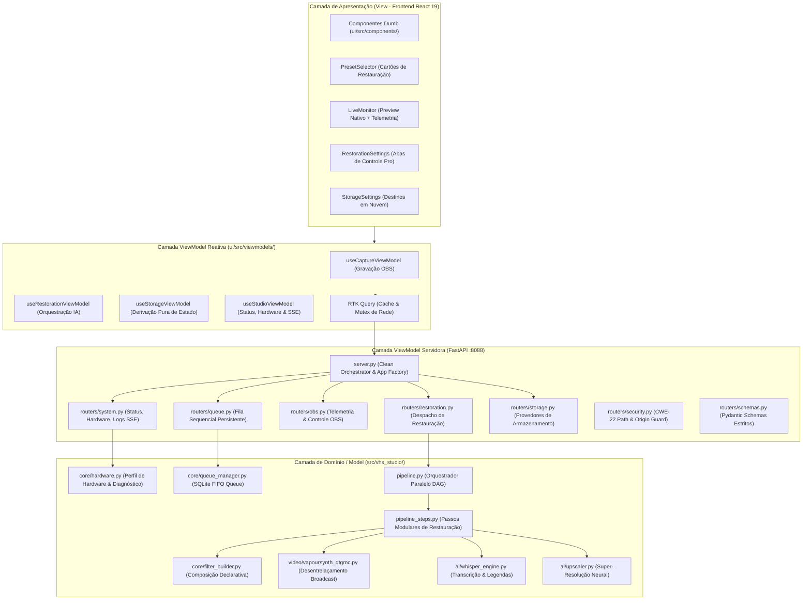
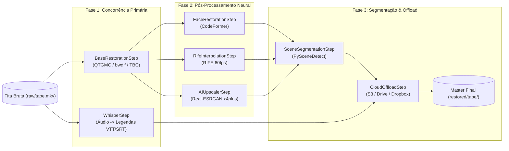

# 📐 Arquitetura do Sistema - VHS Studio Pro

Este documento descreve detalhadamente os padrões arquiteturais, a divisão de camadas, o fluxo de dados, a organização modular e os princípios funcionais aplicados no **VHS Studio Pro**.

---

## 1. Princípios Fundamentais

A arquitetura do VHS Studio Pro foi concebida para atender a requisitos rigorosos de preservação histórica, estabilidade operacional e manutenibilidade pública no GitHub:

1. **Separação de Preocupações (Separation of Concerns - SoC):** A interface de usuário (View), os orquestradores de estado e roteadores (ViewModel) e os motores de domínio (Model) são desacoplados em módulos específicos e testáveis isoladamente.
2. **Princípio da Responsabilidade Única (Single Responsibility Principle - SRP):** Cada módulo possui um propósito delimitado. O servidor de API não implementa manipulação de vídeo direta; os roteadores apenas validam esquemas e despacham; filtros do FFmpeg são construídos por geradores puros; detecção de hardware apenas inspeciona o hospedeiro.
3. **Fonte Única da Verdade (Single Source of Truth - SSOT):** Configurações globais e presets residem em arquivos canônicos:
   - `pyproject.toml` (dependências Python, linters e metadados PEP 621)
   - `package.json` (dependências, scripts e tooling da UI)
   - `vhs_advanced_config.toml` (presets e parâmetros canônicos do motor analógico)
4. **Isolamento de Falhas (Fail-Safe Process Execution):** Motores externos pesados (FFmpeg, VapourSynth, Whisper, Real-ESRGAN, CodeFormer) executam em processos isolados gerenciados pelo `ProcessManager`. Qualquer exceção de driver ou travamento de hardware não afeta a API nem a interface gráfica.
5. **Functional Core / Imperative Shell (FP Core):**
   - O núcleo do sistema é modelado com funções puras e closures idiomáticas sem efeitos colaterais (`make_step_runner`, `make_origin_verifier`, `make_obs_client_provider`, `resolve_deinterlace_filter`, `resolve_codec_video_args`).
   - Mutações de estado compartilhado (`global`) foram 100% eliminadas do projeto.
   - Tipos frouxos (`Any` / `any`) foram substituídos por `TypedDict`, contratos canônicos e interfaces tipadas no Python e no TypeScript.

---

## 2. Camadas da Aplicação (MVVM Strict)



---

## 3. Decomposição Modular da API (routers/)

O arquivo monolítico anterior `server.py` (528 linhas) foi decomposto em sub-módulos coesos em `src/vhs_studio/api/routers/`:

| Módulo | Responsabilidade | Endpoints Principais |
| :--- | :--- | :--- |
| **[`system.py`](file:///c:/Users/danie/Documents/vhs-capture-scripts-main/src/vhs_studio/api/routers/system.py)** | Verificação de integridade, telemetria do hospedeiro e streaming reativo | `GET /api/token`<br>`GET /api/status`<br>`GET /api/hardware`<br>`GET /api/logs`<br>`GET /api/logs/stream` (SSE) |
| **[`queue.py`](file:///c:/Users/danie/Documents/vhs-capture-scripts-main/src/vhs_studio/api/routers/queue.py)** | Gerenciamento transacional da fila persistente em lote | `GET /api/queue`<br>`POST /api/queue/enqueue`<br>`POST /api/queue/cancel/{id}`<br>`POST /api/queue/start`<br>`POST /api/queue/stop` |
| **[`obs.py`](file:///c:/Users/danie/Documents/vhs-capture-scripts-main/src/vhs_studio/api/routers/obs.py)** | Integração via WebSocket v5 com OBS Studio | `GET /api/obs/stats`<br>`POST /api/obs/start`<br>`POST /api/obs/stop`<br>`POST /api/obs/virtualcam` |
| **[`restoration.py`](file:///c:/Users/danie/Documents/vhs-capture-scripts-main/src/vhs_studio/api/routers/restoration.py)** | Disparo de pipelines de restauração, pausa/aborto e comparador A/B | `POST /api/run`<br>`POST /api/action`<br>`GET /api/monitor/comparison-frame`<br>`GET /api/restoration/incomplete` |
| **[`ingest.py`](file:///c:/Users/danie/Documents/vhs-capture-scripts-main/src/vhs_studio/api/routers/ingest.py)** | Hotplug, inspeção forense e extração seletiva Panasonic DVR MEIHDFS | `GET /api/ingest/panasonic/disks`<br>`GET /api/ingest/panasonic/inspect`<br>`GET /api/ingest/panasonic/tree`<br>`POST /api/ingest/panasonic/extract-titles` |
| **[`media.py`](file:///c:/Users/danie/Documents/vhs-capture-scripts-main/src/vhs_studio/api/routers/media.py)** | Entrega e cache de miniaturas de vídeo em tempo real | `GET /api/media/thumbnail` |
| **[`storage.py`](file:///c:/Users/danie/Documents/vhs-capture-scripts-main/src/vhs_studio/api/routers/storage.py)** | Configuração e validação de storage local e nuvem | `GET /api/storage/config`<br>`POST /api/storage/config` |
| **[`security.py`](file:///c:/Users/danie/Documents/vhs-capture-scripts-main/src/vhs_studio/api/routers/security.py)** | Proteção contra path traversal (CWE-22) e origin middleware | `is_safe_media_path`<br>`make_origin_verifier`<br>`SESSION_TOKEN` |
| **[`schemas.py`](file:///c:/Users/danie/Documents/vhs-capture-scripts-main/src/vhs_studio/api/routers/schemas.py)** | Modelos Pydantic para validação de entrada estrita | `StorageConfigPayload`<br>`QueueEnqueuePayload`<br>`ActionPayload`<br>`PanasonicExtractTitlesPayload` |
| **[`server.py`](file:///c:/Users/danie/Documents/vhs-capture-scripts-main/src/vhs_studio/api/server.py)** | Application factory enxuta (84 linhas) e orquestrador de routers | `create_app()`<br>`run_server()` |

---

## 4. Arquitetura DAG da Pipeline de Restauração

O orquestrador [`PipelineOrchestrator`](file:///c:/Users/danie/Documents/vhs-capture-scripts-main/src/vhs_studio/pipeline.py#L40) executa tarefas através de um Grafo Direcionado Acíclico (DAG) com concorrência ótima:



### Isolamento de Passos com Closures
Cada passo pós-processamento utiliza a closure funcional [`make_step_runner`](file:///c:/Users/danie/Documents/vhs-capture-scripts-main/src/vhs_studio/pipeline.py#L27):
```python
def make_step_runner(step_name: str, fn: Callable[[], Optional[str]]) -> Callable[[], Optional[str]]:
    """Closure capturing pipeline step execution with uniform logging and error boundaries."""
    def run() -> Optional[str]:
        try:
            res = fn()
            log.info(f"[{step_name.upper()}] Step completed successfully.")
            return res
        except Exception as exc:
            log.error(f"[{step_name.upper()} ERROR] Step failed: {exc}")
            return None
    return run
```
Essa abordagem garante que uma falha opcional (como CodeFormer sem modelo baixado) não comprometa a entrega do arquivo restaurado principal nem gere corrupção de estado.

---

## 5. Frontend Reativo & Pureza Funcional

O frontend em `ui/src/` segue estritamente as diretrizes modernas do React 19:

1. **Eliminação de Loops de Sincronização (`useEffect`):**
   - No [`useStorageViewModel.ts`](file:///c:/Users/danie/Documents/vhs-capture-scripts-main/ui/src/viewmodels/useStorageViewModel.ts), o estado de configuração é derivado puramente via `useMemo` combinando a configuração padrão, a resposta remota do RTK Query e as modificações ativas do usuário.
   - No [`PrivacyModal.tsx`](file:///c:/Users/danie/Documents/vhs-capture-scripts-main/ui/src/components/PrivacyModal.tsx), a abertura inicial do EULA é computada na inicialização preguiçosa de estado (`useState(() => !localStorage.getItem(...))`), eliminando renderizações em cascata.
2. **Utilidades Puras & Type-Guards:**
   - [`ui/src/lib/errors.ts`](file:///c:/Users/danie/Documents/vhs-capture-scripts-main/ui/src/lib/errors.ts): Função pura [`getErrorMessage`](file:///c:/Users/danie/Documents/vhs-capture-scripts-main/ui/src/lib/errors.ts#L5-L19) para extração segura de mensagens a partir de `unknown`.
   - [`ui/src/lib/formatters.ts`](file:///c:/Users/danie/Documents/vhs-capture-scripts-main/ui/src/lib/formatters.ts): Formatadores puros de telemetria sem efeitos colaterais (`formatBytes`, `formatBitrate`, `formatDuration`).
3. **Zero `any`:**
   - Todo o código TypeScript opera sob verificação estrita (`strict: true`), garantindo que nenhum tipo frouxo ou coerção cega entre em produção.

---

## 6. Qualidade de Código & Verificação Contínua

A codebase é continuamente validada por dois sistemas integrados:

1. **Pre-Commit Hook dos 8 Quality Gates (`scripts/lint.py`):**
   - Oxlint (Frontend linter de alta velocidade)
   - Mypy (Typechecker estrito para Python)
   - Flake8 (Conformidade com PEP 8)
   - JSCPD (Detecção de duplicação de código - 0% clones)
   - Vitest (Testes unitários da UI React)
   - Playwright (Testes de integração E2E)
   - TSC (`tsc --noEmit` para TypeScript)
   - Pytest (Testes unitários e de integração Python)
2. **Swarm Auditors (`scripts/swarm_auditors.py`):**
   - 7 auditores especializados executados em paralelo cobrindo Arquitetura (SoC/SRP), CI/CD, Test Harness, UX/UI & a11y, Segurança, Dependências e Melhores Práticas FP Pure (zero globals, zero Anys, zero TODOs).

---

## 7. Telemetria Broadcast & StatusBar de Rodapé (Padrão NLE)

Inspirado nas grandes estações de trabalho de pós-produção e edição profissional (DaVinci Resolve, Adobe Premiere e Cockos Reaper), o monitoramento de renderização e estado do sistema foi desacoplado em uma **Footer StatusBar permanente**:

1. **Desacoplamento Visual e Fim da Disputa Vertical:**
   - Anteriormente, o painel de telemetria compartilhava a gaveta inferior com o console de diagnósticos, reduzindo a visibilidade dos logs e dificultando o redimensionamento.
   - Com a [`FooterStatusBar`](file:///c:/Users/danie/Documents/vhs-capture-scripts-main/ui/src/components/FooterStatusBar.tsx), o console possui 100% de flexibilidade vertical no [`ConsoleViewer`](file:///c:/Users/danie/Documents/vhs-capture-scripts-main/ui/src/components/ConsoleViewer.tsx), com suporte contínuo a arrasto via `react-resizable-panels`.
2. **Parser Funcional Puro (`createTelemetryParser`):**
   - Implementado como uma closure factory determinística sem variáveis mutáveis soltas.
   - Elimina os antigos saltos arbitrários de percentual (`STAGE_FALLBACK_PERCENTAGES`) em favor de uma derivação honesta e progressiva:
     - Leitura de quadros reais (`currentFrames / totalFrames * 100`).
     - Sinais explícitos do orquestrador (`[PROGRESS: X%]`).
     - Ou ancoragem proporcional da etapa ativa (`(stage - 1) / totalStages * 100`).
3. **Resolução Dinâmica de Etapas (`getPresetStages`):**
   - A lista de etapas dos breadcrumbs adapta-se dinamicamente ao preset selecionado (Ouro Master, Velocidade, TBC Frame-Hold, IA Master ou Customizado).
4. **Stripe Superior Ultra-Fino:**
   - Durante a renderização, uma linha sutil de 2.5px com gradiente animado (`sky-400` → `emerald-400` → `indigo-400`) fornece feedback no topo da aplicação sem consumir área útil.

---

## 8. Robustez de Subprocessos Windows (OEM CP850 / UTF-8)

Ambientes Windows em língua portuguesa (ou outras variantes regionais) emitem saídas de comandos nativos (`tasklist`, `netstat`, utilitários do sistema) codificados na página de código OEM da máquina (como CP850 ou CP1252), onde caracteres acentuados como `Ç` geram o byte `0x80`.

Quando subprocessos Python lêem pipes de texto com UTF-8 estrito, o `_readerthread` interno do `subprocess.py` dispara `UnicodeDecodeError: 'utf-8' codec can't decode byte 0x80 in position 7: invalid start byte`.

Para imunizar completamente a plataforma:
- Todos os despachos de `subprocess.run` e `subprocess.Popen` em modo texto especificam obrigatoriamente `errors="replace"`.
- As chamadas em [`system.py`](file:///c:/Users/danie/Documents/vhs-capture-scripts-main/src/vhs_studio/api/routers/system.py), [`watcher.py`](file:///c:/Users/danie/Documents/vhs-capture-scripts-main/src/vhs_studio/cli/watcher.py), [`setup_qtgmc.py`](file:///c:/Users/danie/Documents/vhs-capture-scripts-main/src/vhs_studio/cli/setup_qtgmc.py), [`process_manager.py`](file:///c:/Users/danie/Documents/vhs-capture-scripts-main/src/vhs_studio/api/process_manager.py) e [`hardware.py`](file:///c:/Users/danie/Documents/vhs-capture-scripts-main/src/vhs_studio/core/hardware.py) garantem captura segura e contínua, substituindo bytes ilegíveis por `` sem interromper as threads de leitura.

---

## 9. Verificação Criptográfica de Build (SHA-256)

O lançador Desktop nativo ([`desktop.py`](file:///c:/Users/danie/Documents/vhs-capture-scripts-main/src/vhs_studio/cli/desktop.py)) calcula o hash SHA-256 combinando a árvore de arquivos de `ui/src/` e o `ui/package.json`.

- Se o hash coincidir com `.build_hash` em `ui/dist/`, a compilação do Vite é ignorada, inicializando a janela nativa em menos de 1 segundo.
- Se houver alteração de código ou mismatch, o lançador solicita confirmação interativa do operador antes de compilar novos pacotes ou executar scripts Node.js locais, impedindo execuções automáticas não autorizadas.

---

## 10. Ingestão Panasonic DVR (MEIHDFS & DVD-VR) & Toolchain

Gravadores analógicos/digitais de mesa da Panasonic (linha DMR-E, DMR-EH, DMR-EX, DMR-BWT) gravam seus discos rígidos proprietários em formatos de arquivos específicos:
1. **MEIHDFS-V2.0 e MEIHDFS-V1.0:** Matsushita Electric Industrial Host Disk File System. Superblocos identificados na tabela de partição e nos primeiros setores da mídia.
2. **UDF / DVD-VR (`DVD_RTAV`):** Volumes contendo `VR_MANGR.IFO` e arquivos de fluxo de programa MPEG-2 `.VRO`.
3. **MPEG-2 Program Stream Contínuo:** Pacotes iniciando com o header de sincronismo `0x000001BA` e pacotes PES de vídeo `0x000001E0`.

### Arquitetura de Resolução em Toolchain:
Em vez de misturar código C legados ao repositório Python, o sistema adota a arquitetura de **Toolchain Desacoplado**:
- **Resolução de Binários:** Os utilitários compilados `extract_meihdfs`, `dvd-vr` e `vro2split` são buscados prioritariamente no diretório portátil `tools/panasonic_rec/` e subsequentemente no `PATH` do sistema via [`paths.py`](file:///c:/Users/danie/Documents/vhs-capture-scripts-main/src/vhs_studio/core/paths.py) e [`Toolchain`](file:///c:/Users/danie/Documents/vhs-capture-scripts-main/src/vhs_studio/core/toolchain.py).
- **Compilação Cruzada Automatizada:** O script [`scripts/build_panasonic_tools.py`](file:///c:/Users/danie/Documents/vhs-capture-scripts-main/scripts/build_panasonic_tools.py) compila os binários em Windows (MinGW/MSVC), Linux (GCC) e macOS (Clang) no ambiente de desenvolvimento e durante o CI/CD.
- **Hotplug Contínuo (3s Polling) & Auto-Config:** Polling automático detecta conexões físicas de pontes USB-SATA (**JMicron JMS567**, **ASMedia**) e unidades de bloco, auto-expandindo o card e carregando a árvore de gravações sem clique manual.
- **Árvore de Gravações & Capítulos:** Endpoint `GET /api/ingest/panasonic/tree` decompõe a mídia em títulos, timecodes formatados, divisões de capítulos e miniaturas em tempo real.
- **Fallback Pure-Python:** Quando os binários nativos não estiverem presentes, o carver em Python puro (`panasonic_dvr.py`) assume a recuperação diretamente dos setores brutos.

---

## 11. Política Anti-Hardcode e Internacionalização (Zero-Hardcode Policy)

Conforme estabelecido em [`AGENTS.md`](file:///c:/Users/danie/Documents/vhs-capture-scripts-main/AGENTS.md) e [`GEMINI.md`](file:///c:/Users/danie/Documents/vhs-capture-scripts-main/GEMINI.md), qualquer texto voltado ao usuário deve estar estritamente isolado da camada de código:
1. **100% i18n:** Todo componente React deve utilizar `t('namespace.key')` do `react-i18next`. Strings estáticas em JSX, alertas, tooltips ou botões são proibidas.
2. **10 Idiomas Nativos:** Suporte unificado para Português (`pt-BR`), Inglês (`en-US`), Espanhol (`es`), Francês (`fr`), Alemão (`de`), Italiano (`it`), Japonês (`ja`), Árabe (`ar`, com layout RTL), Russo (`ru`) e Chinês Simplificado (`zh-CN`).
3. **SSOT para Constantes:** Valores numéricos, extensões e caminhos de diretório devem residir exclusivamente em `constants.py` e `paths.py`.

---

## 12. Monitor Comparativo A/B Split-Screen (`<SplitComparisonMonitor />`)

Para inspecionar os efeitos da cadeia de restauração (desentrelaçamento, denoise, TBC e alinhamento de croma) sem competir com a masterização:
- **Proxy Downscaler de Baixa Latência (360p / 15fps):** O endpoint `GET /api/monitor/comparison-frame` extrai e processa um par de quadros (RAW vs Tratado) consumindo menos de 2% de CPU e respondendo em menos de 50ms.
- **Divisor Interativo:** O componente React [`SplitComparisonMonitor.tsx`](file:///c:/Users/danie/Documents/vhs-capture-scripts-main/ui/src/components/SplitComparisonMonitor.tsx) implementa uma cortina divisória com arraste contínuo de mouse, navegação por teclado (`ArrowLeft` / `ArrowRight`) e controle temporal de posição.
- **Desativação Total (Zero Overhead):** O operador pode desligar o monitor a qualquer instante para dedicar 100% dos ciclos de máquina ao processamento principal.

---

## 13. Otimização de GPU Integrada (UMA) & Balanceamento de Hardware

Em máquinas equipadas com gráficos integrados (Intel UHD Graphics 770 / Iris Xe / AMD Radeon Vega/RDNA):
1. **Memória Unificada (UMA - Unified Memory Architecture):** A VRAM e a RAM compartilham fisicamente os mesmos canais de memória. Decodificar na GPU para transferir para o Python via barramento PCIe gera tráfego redundante. Mantemos a decodificação de entrada em software multi-thread na RAM nativa e transferimos dados diretamente para computação.
2. **Vulkan NCNN (Real-ESRGAN):** Executado diretamente via backend Vulkan (`-g 0`). O NCNN aloca buffers de tensores na memória compartilhada acessível pelas Execution Units da iGPU, atingindo máxima vazão sem sobrecarregar a CPU.
3. **Aceleração Hardware QuickSync / AMF:** Encoders como `h264_qsv` operam em blocos de função fixa (*fixed-function silicon*), deixando a CPU livre para VapourSynth QTGMC.
4. **Calibração de Threads do Whisper:** Limitação de concorrência a 4-8 threads para evitar 100% de ocupação sustentada da CPU e estrangulamento térmico (*thermal throttling*).

---

## 14. Terminal TUI & Entrada Não-Bloqueante Multiplataforma

A interface de linha de comando ([`tui.py`](file:///c:/Users/danie/Documents/vhs-capture-scripts-main/src/vhs_studio/cli/tui.py)) oferece paridade simétrica entre plataformas:
- **POSIX (Linux / macOS):** Utiliza `termios`, `tty.setcbreak()` e `select.select()` para leitura assíncrona não-bloqueante de sequências de escape ANSI (`\x1b[A`, `\x1b[B`, etc.).
- **Windows:** Utiliza chamadas da CRT do Windows (`msvcrt.kbhit()` e `msvcrt.getch()`).
- O operador navega pelos menus com setas (`↑`, `↓`, `←`, `→`), confirma com `ENTER`, seleciona com `ESPAÇO` e pausa/aborta com `Q` ou `ESC` de forma idêntica em Bash, Zsh, CMD e PowerShell.

---

## 15. Controle de Processos em Tempo Real & Recuperação de Jobs Incompletos

Para evitar perda de horas de digitalização em caso de interrupções:
1. **Pausa e Retomada Instantâneas:**
   - `pause_process`: Suspende a execução do processo via sinais de sistema (`SIGSTOP` em POSIX / `SuspendThread` em Windows), desocupando imediatamente CPU e GPU sem perder o progresso.
   - `resume_process`: Reativa o processo (`SIGCONT` / `ResumeThread`).
2. **Abort Limpo:** `abort_process` encerra os subprocessos filhos, libera arquivos de lock e evita arquivos corrompidos.
3. **Subsistema de Recuperação de Jobs ([`job_recovery.py`](file:///c:/Users/danie/Documents/vhs-capture-scripts-main/src/vhs_studio/video/job_recovery.py)):**
   - Detecta arquivos temporários (`.tmp.mp4`, `.tmp.mkv`) deixados por falhas de energia ou encerramento abrupto.
   - Oferece três ações determinísticas via API (`/api/restoration/incomplete/action`):
     - **`resume`**: Retoma do último frame processado.
     - **`finalize`**: Repara o contêiner de vídeo via FFmpeg copiando fluxos (`-c copy`) e escrevendo o átomo `moov` no início (`-movflags +faststart`), tornando o vídeo parcial reproduzível imediatamente.
     - **`discard`**: Limpa arquivos parciais com segurança.

