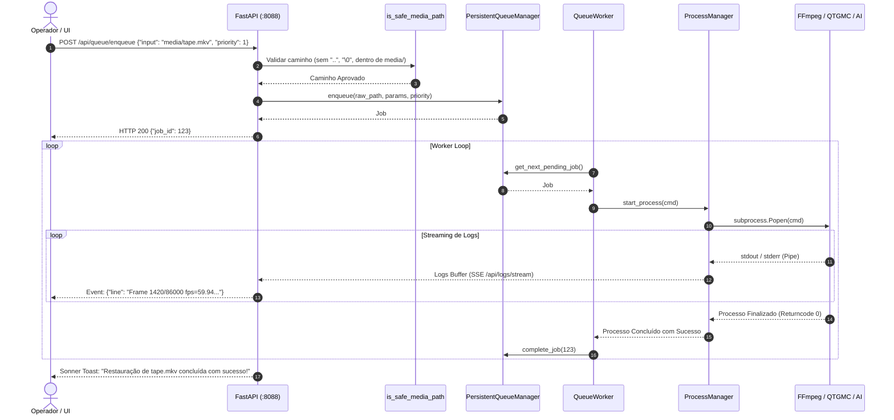

# 📐 Arquitetura do Sistema - VHS Studio Pro

Este documento descreve detalhadamente os padrões arquiteturais, a divisão de camadas, o fluxo de dados e os princípios de design aplicados no **VHS Studio Pro**.

---

## 1. Princípios Fundamentais

A arquitetura do VHS Studio Pro foi concebida para atender a requisitos rigorosos de preservação histórica, estabilidade operacional e desempenho:

1. **Separação de Preocupações (Separation of Concerns - SoC):** A interface de usuário (View), o roteamento da API e o gerenciamento de processos (ViewModel) e as engines de captura/restauração (Model) são isolados em módulos com contratos bem delimitados.
2. **Princípio da Responsabilidade Única (Single Responsibility Principle - SRP):** Cada módulo possui um propósito único. Motores de IA não gerenciam conexões WebSocket; a API REST não orquestra pipelines de vídeo diretamente; classes de hardware apenas diagnosticam o hospedeiro.
3. **Fonte Única da Verdade (Single Source of Truth - SSOT):** Configurações globais e presets residem em arquivos canônicos:
   - `pyproject.toml` (dependências Python, linters e metadados do pacote PEP 621)
   - `package.json` (dependências e scripts da UI)
   - `vhs_advanced_config.toml` (presets e parâmetros do motor de restauração)
4. **Isolamento de Falhas (Fail-Safe Execution):** Processos pesados (FFmpeg, VapourSynth, Whisper, Real-ESRGAN) rodam em subprocessos desacoplados controlados pelo `ProcessManager`, evitando que qualquer travamento em um driver de GPU derrube a API ou o aplicativo desktop.

---

## 2. Camadas da Aplicação

### 2.1 Camada de Apresentação (View - Frontend)
Localizada em `ui/src/`, a interface gráfica é uma Single-Page Application (SPA) construída com:
- **React 19 + TypeScript:** Tipagem estrita com zero `any` no código de produção.
- **Tailwind CSS:** Design system responsivo e focado em alto contraste.
- **Redux Toolkit Query (RTK Query):** Gerenciamento de estado de rede, cache de status e mutações assíncronas.
- **Server-Sent Events (SSE):** Consumo em tempo real dos logs de processamento sem sobrecarga de polling HTTP contínuo.
- **Radix UI Primitives + Lucide Icons:** Componentes acessíveis com foco no teclado.
- **Sonner Toast:** Sistema acessível de feedback visual dinâmico com sons opcionais e animações fluidas.
- **i18next:** Internacionalização instantânea (`pt-BR`, `en-US`, `es-ES`).

### 2.2 Camada de Coordenação e Serviço (ViewModel - API Server)
Localizada em `src/vhs_studio/api/`:
- **FastAPI / Uvicorn:** Servidor assíncrono leve rodando em porta local configurável (padrão `8088`).
- **Segurança de Entrada:** Middleware de validação de `Host` e `Origin`, verificação de `X-Session-Token` e validação canônica de caminhos com `is_safe_media_path`.
- **ProcessManager:** Gerenciador singleton que inicia, monitora via pipe de streaming e finaliza processos externos de forma não bloqueante.
- **OBSClient:** Cliente WebSocket v5 síncrono com retries inteligentes, reconexão automática e telemetria em tempo real (taxa de bits, fps, tempo de gravação, CPU e memória).

### 2.3 Camada de Negócio e Restauração (Model - Core Engine)
Localizada em `src/vhs_studio/`:
- **`core/hardware.py` (Hardware Abstraction Layer):** Detecta a topologia da CPU, memória disponível e aceleração gráfica suportada (CUDA, AMF, QuickSync, VideoToolbox).
- **`core/filter_builder.py`:** Constrói dinamicamente cadeias de filtros complexas do FFmpeg adaptadas à GPU do usuário.
- **`core/queue_manager.py`:** Banco de dados SQLite persistente para enfileiramento sequencial (FIFO) de múltiplos arquivos, permitindo lotes de restauração sem saturação de recursos.
- **`video/vapoursynth_qtgmc.py`:** Script gerador e executor de VapourSynth com QTGMC para desentrelaçamento temporal analógico perfeito.
- **`ai/whisper_engine.py`:** Transcrição de áudio, segmentação de fala e geração de legendas VTT/SRT.
- **`ai/upscaler.py`:** Restauração por redes neurais convolucionais (Real-ESRGAN x4plus).
- **`storage/`:** Adaptadores de armazenamento (Local, AWS S3, Google Drive OAuth2, Dropbox).

---

## 3. Diagrama Detalhado de Sequência (Execução de Restauração)



---

## 4. Estrutura de Diretórios Canônica

```
vhs-capture-scripts/
├── .github/workflows/          # Workflows do GitHub Actions (CI, Build, Release)
├── docs/                       # Documentação técnica e manuais de operação
├── logs/                       # Relatórios de build e logs de execução JSON Lines
├── media/                      # Diretório de trabalho de mídias analógicas
│   ├── raw/                    # Capturas brutas entrelaçadas do OBS
│   ├── work/                   # Arquivos temporários e passes intermediários
│   └── restored/               # Arquivos finais restaurados e masters arquivísticos
├── scripts/                    # Scripts de automação, hooks de lint e enxame de auditores
│   ├── lint.py                 # Validador dos 8 Quality Gates
│   └── swarm_auditors.py       # Auditoria paralela de arquitetura e segurança
├── src/vhs_studio/             # Código fonte principal Python
│   ├── ai/                     # Motores de IA (Whisper, Real-ESRGAN, SceneDetect)
│   ├── api/                    # Servidor FastAPI, rotas, middleware e WebSocket OBS
│   ├── cli/                    # Pontos de entrada CLI e lançador Desktop Pro
│   ├── config/                 # Gerenciamento de credenciais e storage
│   ├── core/                   # HAL, logger, caminhos, constantes e fila SQLite
│   ├── storage/                # Provedores de nuvem (S3, Drive, Dropbox)
│   └── video/                  # Filtros de vídeo, VapourSynth e QTGMC
├── tests/                      # Suíte completa de testes unitários e de integração Pytest
└── ui/                         # Frontend React 19 + TypeScript + Vite + Tailwind CSS
    ├── src/                    # Componentes React, hooks, store e i18n
    └── tests/                  # Testes unitários Vitest e testes E2E Playwright
```
