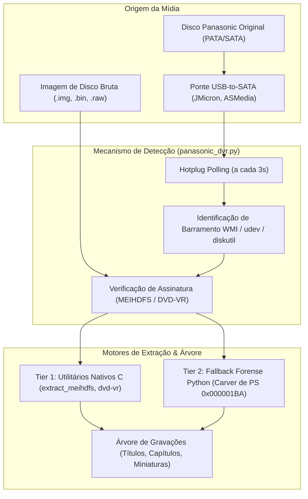

# 📀 Manual Técnico de Ingestão Panasonic DVR & MEIHDFS-V2.0

Este documento descreve detalhadamente a arquitetura forense, o sistema de arquivos proprietário **MEIHDFS**, os binários nativos em C, o sistema de hotplug com auto-detecção em tempo real e os fluxos de extração de gravações e capítulos a partir de gravadores de DVD/HDD da Panasonic (família **DMR-EH**, **DMR-ES**, **DMR-E**).

---

## 1. Contexto Histórico & O Desafio do Sistema MEIHDFS

Os gravadores de mesa Panasonic (ex: **DMR-EH50, DMR-EH55, DMR-EH65, DMR-ES10**) utilizam drives de disco rígido IDE/PATA ou SATA formatados com um sistema de arquivos proprietário desenvolvido pela Matsushita: o **MEIHDFS** (*Matsushita Electronic Industrial Hard Disk File System*), principalmente nas versões:
- **MEIHDFS-V1.0**: Modelos da primeira geração de gravadores com HDD (família DMR-E80H, DMR-E85H, DMR-E100H).
- **MEIHDFS-V2.0**: Modelos a partir de 2005/2006 (família DMR-EH50, DMR-EH55, DMR-EH60D, etc.).
- **DVD-VR (Video Recording Format)**: Estrutura lógica de vídeo baseada em pacotes MPEG-2 Program Stream multiplexados (`VR_MOVIE.VRO`) e gerenciamento de títulos e capítulos (`VR_MANGR.IFO`).

### ⚠️ Alerta Forense Crítico de Integridade
> [!CAUTION]
> **NUNCA FORMATE O DISCO QUANDO O SISTEMA OPERACIONAL SOLICITAR!**
> Sistemas operacionais convencionais (Windows, macOS e Linux) não reconhecem partições MEIHDFS nativamente. Ao conectar o disco do gravador via adaptador USB-to-SATA ou porta SATA direta, o Windows emitirá um diálogo: *"O disco precisa ser formatado antes de poder ser usado"*.
> **Se você clicar em Formatar, a tabela de alocação de blocos e todos os cabeçalhos de gravação serão destruídos permanentemente.** O VHS Studio Pro lê a mídia em modo bruto de baixo nível e dispensa qualquer formatação pelo SO.

---

## 2. Métodos de Conexão e Clonagem Forense

O VHS Studio Pro suporta tanto o acesso a **discos físicos conectados** quanto a **imagens brutas de disco (bit-a-bit)**.



### 2.1 Conexão Física Direta & Adaptadores USB Recomendados
Ao conectar o HDD do Panasonic ao computador, utilize adaptadores USB-to-SATA de alta compatibilidade:
- Chipsets testados: **JMicron JMS567**, **ASMedia ASM1153E**, **Realtek RTL9210B**.
- O backend identifica automaticamente as assinaturas de hardware do adaptador (`is_jmicron`, `is_asmedia`, `is_usb`) através de consultas WMI no Windows, `udev` no Linux e `diskutil` no macOS.

### 2.2 Criação de Imagem de Disco Bruta (Dump Bit-a-Bit)
Para preservar o drive mecânico original contra desgaste ou riscos de falha física na cabeça de leitura, recomenda-se gerar uma imagem bit-a-bit:
- **Linux / macOS:**
  ```bash
  sudo dd if=/dev/sdX of=/caminho/panasonic_dump.img bs=64k status=progress conv=noerror,sync
  ```
- **Windows:** Utilize ferramentas como **FTK Imager** (Create Disk Image -> Raw dd) ou **Win32DiskImager** para criar um arquivo `.img` ou `.bin`.

---

## 3. Binários Nativos em C (`tools/panasonic_rec/`)

O VHS Studio Pro integra ferramentas de recuperação de baixo nível desenvolvidas originalmente em C (referência: [leecher1337/panasonic-rec](https://github.com/leecher1337/panasonic-rec)):

| Binário / Utilitário | Descrição e Finalidade |
| :--- | :--- |
| **`extract_meihdfs`** | Utilitário primário de inspeção e extração do sistema de arquivos MEIHDFS-V2.0. Lê o superbloco, localiza inodes e extrai o fluxo contínuo de vídeo em bloco para arquivos `.vro`. |
| **`dvd-vr`** | Analisador lógico da especificação DVD-VR. Lê arquivos de gerenciamento (`VR_MANGR.IFO`), mapeia a divisão de programas, timecodes de início/fim e índices de capítulos. |
| **`vro2split`** | Ferramenta especializada em segmentação de arquivos `.vro` fragmentados em títulos MPEG-2 Program Stream individuais (`.mpg` / `.m2v` / `.ac3`). |

### 3.1 Script de Compilação Multiplataforma (`scripts/build_panasonic_tools.py`)
Para garantir 100% de compatibilidade entre sistemas operacionais sem dependência de binários proprietários pré-compilados:
- **Windows:** Compilação com MinGW GCC (`gcc -O2 ...`) gerando executáveis `.exe`.
- **Linux:** Compilação nativa com GCC (`gcc -O2 ...`) gerando binários ELF em `tools/panasonic_rec/`.
- **macOS:** Compilação nativa com Clang / Apple LLVM gerando binários Mach-O (Intel x86_64 e Apple Silicon ARM64).

Para compilar manualmente no ambiente local:
```bash
python scripts/build_panasonic_tools.py
```

---

## 4. Hotplug em Tempo Real & Auto-Configuração

O fluxo de ingestão no componente [`PanasonicIngestCard.tsx`](file:///c:/Users/danie/Documents/vhs-capture-scripts-main/ui/src/components/PanasonicIngestCard.tsx) opera de forma **100% autônoma e reativa**:

1. **Monitoramento Hotplug Contínuo:**
   - O RTK Query executa polling a cada **3.000 ms** chamando `GET /api/ingest/panasonic/disks`.
   - Quando um novo dispositivo de bloco com partição MEIHDFS ou adaptador USB (JMicron/ASMedia) é conectado, o estado reativo dispara o evento.
2. **Auto-Configuração Imediata (Sem Botão "Conectar"):**
   - O card expande automaticamente na barra lateral do estúdio.
   - O caminho do dispositivo é associado e a requisição `GET /api/ingest/panasonic/tree` é emitida.
   - Um toast informativo notifica o operador: *"Disco Panasonic detectado! Partição MEIHDFS carregada automaticamente."*
3. **Árvore de Gravações Interativa:**
   - Apresenta a lista completa de gravações encontradas no disco.
   - Cada gravação exibe miniatura gerada em tempo real (`/api/media/thumbnail?path=...`), tamanho (`MB` ou `GB`), duração formatada (`HH:MM:SS`) e data de gravação.
   - **Accordion de Capítulos:** Expande a segmentação de capítulos em intervalos de 15 minutos ou marcas de corte do operador original.
4. **Extração Seletiva e Envio para a Mesa:**
   - **Extrair Selecionados:** Extrai em alta velocidade via binário C apenas os títulos selecionados para `media/raw/`.
   - **Carregar na Mesa:** Com 1 clique, define o arquivo diretamente como entrada ativa no `useStudioStore` para restauração direta ou desentrelaçamento QTGMC.

---

## 5. Tier 2: Carver Forense em Python Puro (Fallback)

Caso os binários compilados em C não estejam presentes no sistema ou o superbloco MEIHDFS esteja severamente corrompido, o módulo [`src/vhs_studio/ingest/panasonic_dvr.py`](file:///c:/Users/danie/Documents/vhs-capture-scripts-main/src/vhs_studio/ingest/panasonic_dvr.py) ativa o **Carver Forense Pure-Python**:
1. Lê o disco ou imagem em blocos alinhados de 64 KB.
2. Localiza cabeçalhos de pacote MPEG-2 Program Stream (`0x00 0x00 0x01 0xBA`).
3. Reconstitui os fluxos contínuos de vídeo e áudio descartando blocos corrompidos ou não-alinhados.
4. Salva os títulos recuperados na pasta `media/raw/` prontos para ingestão.
