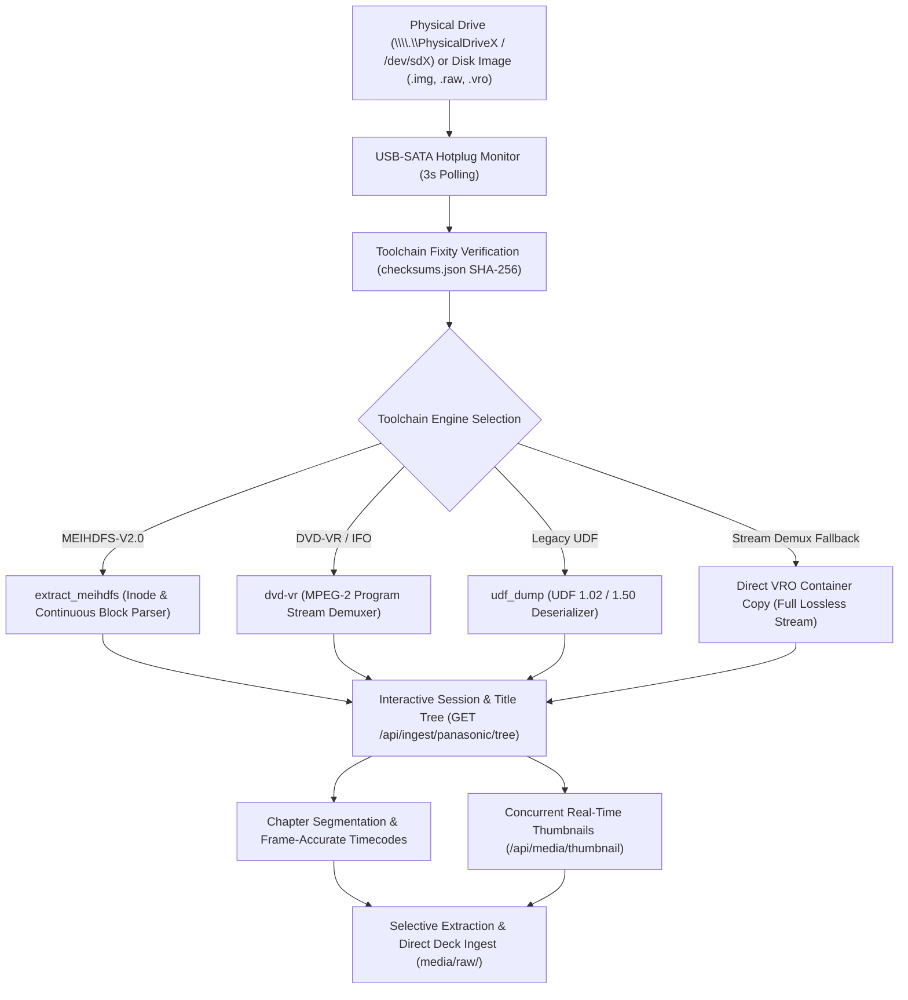

# 📀 Panasonic DVR & MEIHDFS-V2.0 Ingest Technical Manual

This manual provides a detailed technical specification of the forensic acquisition architecture, the proprietary Matsushita **MEIHDFS** file system, native C toolchain binaries, continuous hardware hotplug polling, and automated title/chapter extraction flows for Panasonic DVD/HDD field recorders (**DMR-EH**, **DMR-ES**, and **DMR-E** families).

---

## 1. Historical Context & The MEIHDFS Challenge

Panasonic standalone consumer and broadcast DVR recorders (e.g., **DMR-EH50, DMR-EH55, DMR-EH65, DMR-ES10**) write audio/video streams to internal IDE/PATA or SATA hard drives formatted with a proprietary, undocumented filesystem developed by Matsushita Electric Industrial: **MEIHDFS** (*Matsushita Electronic Industrial Hard Disk File System*).

Across production generations, three primary logical storage formats are encountered:
- **MEIHDFS-V1.0:** Utilized in first-generation HDD recorder models (such as the DMR-E80H, DMR-E85H, and DMR-E100H series).
- **MEIHDFS-V2.0:** Introduced around 2005/2006 for enhanced sector allocation and larger hard drives (DMR-EH50, DMR-EH55, DMR-EH60D, DMR-EH65, etc.).
- **DVD-VR (Video Recording Format):** The logical video stream encapsulation layer based on multiplexed MPEG-2 Program Stream (`VR_MOVIE.VRO`) data containers and structured navigation metadata management (`VR_MANGR.IFO`).

### ⚠️ Critical Forensic Data Integrity Warning
> [!CAUTION]
> **NEVER FORMAT THE DISK WHEN PROMPTED BY THE OPERATING SYSTEM!**
> Standard operating systems (Windows, macOS, and Linux) cannot mount MEIHDFS partitions natively. When connecting an extracted recorder hard drive via a USB-to-SATA adapter bridge or direct SATA port, Windows will prompt: *"You need to format the disk before you can use it"*.
> **Clicking "Format" permanently destroys the root inode allocation tables and recording headers.** VHS Studio Pro accesses the media in raw, read-only low-level block mode and never requires OS-level mounting or formatting.

---

## 2. Forensic Acquisition & Physical Connection Methods

VHS Studio Pro supports both **directly attached physical block drives** and **raw sector-by-sector disk image files**.


```mermaid
flowchart TD
    Drive["Physical Drive (\\\\.\\PhysicalDriveX / /dev/sdX) or Disk Image (.img, .raw, .vro)"] --> Hotplug["USB-SATA Hotplug Monitor (3s Polling)"]
    Hotplug --> Verify["Toolchain Fixity Verification (checksums.json SHA-256)"]
    
    Verify --> ToolSelect{"Toolchain Engine Selection"}
    
    ToolSelect -->|"MEIHDFS-V2.0"| ExtractMeihdfs["extract_meihdfs (Inode & Continuous Block Parser)"]
    ToolSelect -->|"DVD-VR / IFO"| DvdVr["dvd-vr (MPEG-2 Program Stream Demuxer)"]
    ToolSelect -->|"Legacy UDF"| UdfDump["udf_dump (UDF 1.02 / 1.50 Deserializer)"]
    ToolSelect -->|"Stream Demux Fallback"| VroCopy["Direct VRO Container Copy (Full Lossless Stream)"]
    
    ExtractMeihdfs --> Tree["Interactive Session & Title Tree (GET /api/ingest/panasonic/tree)"]
    DvdVr --> Tree
    UdfDump --> Tree
    VroCopy --> Tree
    
    Tree --> Thumbs["Concurrent Real-Time Thumbnails (/api/media/thumbnail)"]
    Tree --> Chapters["Chapter Segmentation & Frame-Accurate Timecodes"]
    
    Chapters --> Export["Selective Extraction & Direct Deck Ingest (media/raw/)"]
    Thumbs --> Export
```

### 2.1 Direct Hardware Connection & Recommended USB Adapters

When connecting a Panasonic DVR hard drive to the workstation, select high-compatibility USB-to-SATA bridges that support pass-through of raw 512-byte / 4096-byte sectors without proprietary hardware encryption:
- **Verified Chipsets:** **JMicron JMS567**, **ASMedia ASM1153E**, **Realtek RTL9210B**.
- The backend automatically detects hardware controller signatures (`is_jmicron`, `is_asmedia`, `is_usb`) via WMI queries on Windows, `udev` attributes on Linux, and `diskutil` / IOKit properties on macOS.

### 2.2 Forensic Bit-Level Disk Image Creation (Raw Dump)

To prevent physical wear on fragile mechanical drive bearings and reading heads, best practice dictates cloning an uncompressed bitstream image before extraction:
- **Linux / macOS:**
  ```bash
  sudo dd if=/dev/sdX of=/path/to/panasonic_dump.img bs=64k status=progress conv=noerror,sync
  ```
- **Windows:** Utilize **FTK Imager** (*Create Disk Image -> Raw dd*) or **Win32DiskImager** to generate a flat `.img` or `.raw` bitstream container.

---

## 3. Vendored Native C Utilities (`tools/panasonic_rec/`)

VHS Studio Pro integrates low-level extraction and demuxing tools originally authored in C (upstream reference: [leecher1337/panasonic-rec](https://github.com/leecher1337/panasonic-rec)):

| Utility / Binary | Architecture & Purpose |
| :--- | :--- |
| **`extract_meihdfs`** | Primary MEIHDFS-V2.0 inspection and extraction engine. Reads the superblock, traverses the inode table, and extracts contiguous recording blocks directly into intact `.vro` streams. |
| **`dvd-vr`** | Logical parser for the DVD-VR specification. Parses `VR_MANGR.IFO`, maps program division, calculates frame-accurate start/stop timecodes, and indexes chapter markers. |
| **`vro2split`** | Stream demuxer specialized in segmenting fragmented `.vro` containers into isolated MPEG-2 Program Stream files (`.mpg`, `.m2v`, `.ac3`). |
| **`udf_dump`** | Deserializer and extractor for legacy first-generation recorders utilizing UDF 1.02/1.50 filesystems. |

### 3.1 Cross-Platform Compilation Pipeline (`scripts/build_panasonic_tools.py`)

To eliminate reliance on untrusted external precompiled binaries while maintaining complete platform independence:
- **Windows:** Compiled with MinGW GCC (`gcc -O2 -s ...`) generating standalone `.exe` executables.
- **Linux:** Native compilation via GCC (`gcc -O2 -s ...`) producing static/dynamic ELF binaries in `tools/panasonic_rec/`.
- **macOS:** Native compilation with Clang / Apple LLVM generating Mach-O binaries (supporting both x86_64 and Apple Silicon ARM64) with 64-bit file offset compatibility (`off_t` / `lseek`).

Compile locally using:
```bash
python scripts/build_panasonic_tools.py
```

### 3.2 Cryptographic Fixity & Zero-Trust Supply Chain (`checksums.json`)

Following zero-trust supply chain best practices, VHS Studio Pro enforces strict binary verification before executing native executables:

1. **Canonical Fixity Manifest ([`tools/panasonic_rec/checksums.json`](file:///c:/Users/danie/Documents/vhs-capture-scripts-main/tools/panasonic_rec/checksums.json)):**
   Maintains cryptographic SHA-256 digests and file sizes for official platform builds (`windows-x64`, `linux-x86_64`, `darwin-arm64`).
2. **Build Verification:**
   When running on systems utilizing pre-compiled binaries, the toolchain verifies hashes byte-for-byte. Any mismatch halts execution immediately with a fatal security exception (`[SECURITY ERROR] / [FATAL]`).
3. **On-Demand Manifest Audit:**
   ```bash
   python scripts/build_panasonic_tools.py --verify
   ```
4. **Maintainer Manifest Update:**
   ```bash
   python scripts/build_panasonic_tools.py --update-manifest
   ```
5. **Runtime Fixity Enforcement:**
   [`Toolchain`](file:///c:/Users/danie/Documents/vhs-capture-scripts-main/src/vhs_studio/core/toolchain.py) invokes [`FixityChecker`](file:///c:/Users/danie/Documents/vhs-capture-scripts-main/src/vhs_studio/archive/fixity.py) prior to launching physical drive extraction subprocesses.

---

## 4. Real-Time Hotplug & Autonomous Configuration

The ingest workflow in [`PanasonicIngestCard.tsx`](file:///c:/Users/danie/Documents/vhs-capture-scripts-main/ui/src/components/PanasonicIngestCard.tsx) operates autonomously and reactively:

1. **Continuous Hotplug Polling:**
   - RTK Query polls `GET /api/ingest/panasonic/disks` every **3,000 ms**.
   - Connecting a block drive with a MEIHDFS partition or a compatible USB bridge automatically triggers state updates.
2. **Instant Auto-Configuration (Zero "Connect" Buttons):**
   - The card auto-expands within the studio sidebar.
   - The device path is bound, and `GET /api/ingest/panasonic/tree` is requested.
   - An accessible toast notifies the operator: *"Panasonic disk detected! MEIHDFS partition loaded automatically."*
3. **Interactive Recording Tree:**
   - Displays all recordings detected on the physical volume or disk dump.
   - Each entry features a real-time thumbnail (`/api/media/thumbnail?path=...`), formatted file size, duration (`HH:MM:SS`), and original recording timestamp.
   - **Chapter Accordion:** Visualizes chapter segmentations at 15-minute intervals or operator cut points.
4. **Selective Ingest & Direct Deck Loading:**
   - **Extract Selected:** Selectively extracts chosen titles via native C tools to `media/raw/` at maximum bus speed.
   - **Load onto Desk:** In 1 click, routes the extracted title into active state within `useStudioStore` for direct QTGMC deinterlacing and neural enhancement.

---

## 5. Zero-Carving Inode Preservation & Stream Demux Fallback

Heuristic sector carving was deliberately retired in VHS Studio Pro. On fragmented Panasonic MEIHDFS drives, unallocated byte carving produces serious data integrity failures: out-of-order video sectors, broken GOP sequences, interleaved multi-title corruption, and irreversible audio/video desynchronization.

Instead, VHS Studio Pro strictly enforces **Zero-Carving Forensic Inode Preservation**:

1. **Inode & Allocation Table Parsing (`extract_meihdfs`):**
   Reads the MEIHDFS superblock, traverses internal inode records, and extracts contiguous recording blocks directly into intact `.vro` streams as recorded by the Panasonic DIGA firmware.
2. **Program Stream Demuxing (`dvd-vr`):**
   Interprets `VR_MANGR.IFO` to calculate accurate title boundaries, program divisions, chapter markers, and presentation timecodes, splitting the recording container into standalone `.mpg` / `.vob` program streams.
3. **Automated Cross-Compilation Fallback:**
   If native binaries are not yet compiled on the host, the system prompts compilation via [`scripts/build_panasonic_tools.py`](file:///c:/Users/danie/Documents/vhs-capture-scripts-main/scripts/build_panasonic_tools.py) with automated SHA-256 verification via [`tools/panasonic_rec/checksums.json`](file:///c:/Users/danie/Documents/vhs-capture-scripts-main/tools/panasonic_rec/checksums.json).
4. **Direct Lossless Container Fallback:**
   If `dvd-vr` cannot split titles due to a damaged or missing `VR_MANGR.IFO` table, the engine safely preserves and copies the intact `.VRO` container file directly to `media/raw/`, enabling lossless direct restoration or external remuxing without risking destructive sector carving.
