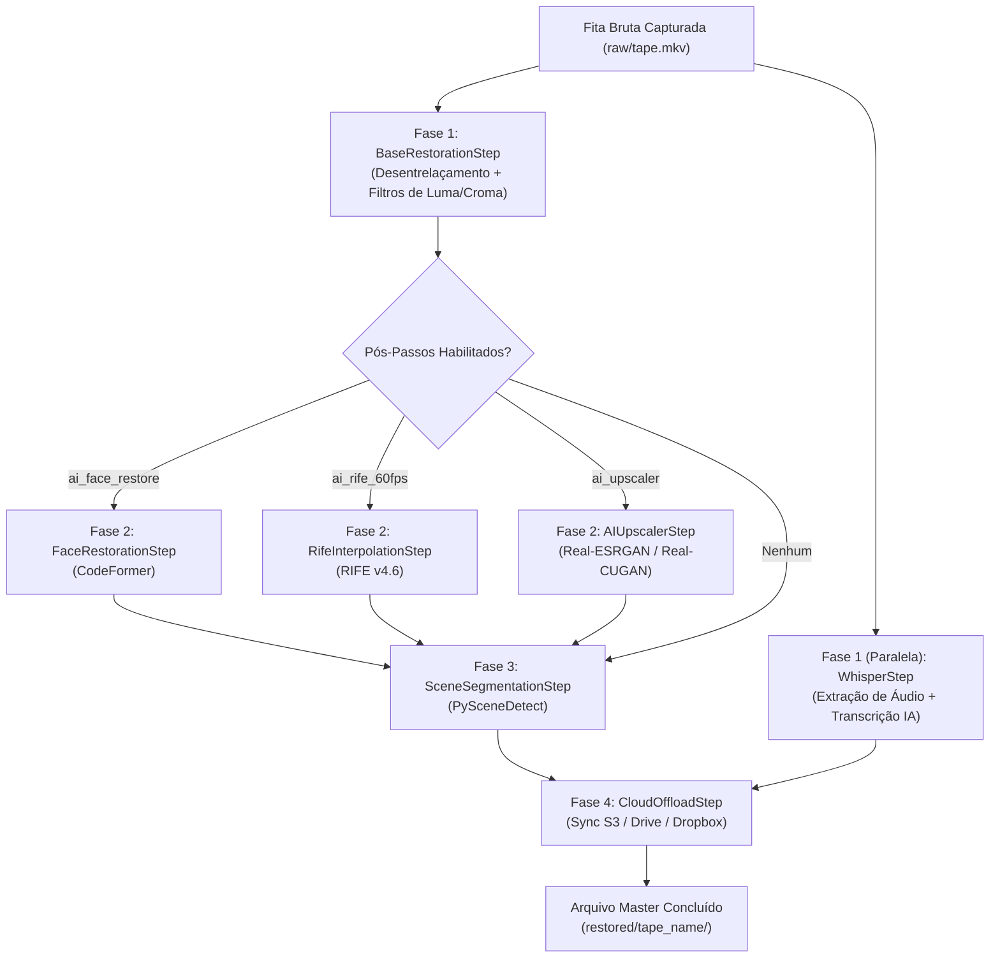

# 🎞️ Manual Técnico da Pipeline de Restauração - VHS Studio Pro

Este guia fornece instruções detalhadas sobre a orquestração do Grafo Direcionado Acíclico (DAG), os motores de processamento, algoritmos de desentrelaçamento, filtros de redução de ruído analógico e modelos de inteligência artificial empregados no **VHS Studio Pro**.

---

## 1. O Desafio do Sinal Analógico de Vídeo

O vídeo analógico (VHS, S-VHS, Betamax, Video8, Hi8) possui particularidades que tornam a sua restauração digital muito mais complexa do que uma simples conversão de formato:

1. **Campos Entrelaçados (Interlacing):** O sinal é composto por 59.94 (NTSC) ou 50 (PAL) *campos* temporais por segundo, onde linhas pares e ímpares foram capturadas em instantes diferentes no tempo.
2. **Ruído de Croma (Chroma Noise / Rainbowing):** A largura de banda da subportadora de cor no VHS é extremamente limitada (~0.6 MHz), gerando manchas avermelhadas e azuladas flutuantes.
3. **Instabilidade Temporal (Jitter / TBC Errors):** Variações mecânicas na velocidade da fita causam linhas tortas horizontais (*flagging*) e perda de sincronismo entre quadros.
4. **Descompasso A/V Cumulativo:** Quedas de sinal sem um TBC de hardware levam a dessincronia crônica entre o áudio contínuo e os quadros de vídeo dropados.

---

## 2. Orquestração DAG Paralela (`pipeline.py`)

O VHS Studio Pro substitui scripts lineares monolíticos por um orquestrador modular concorrente baseado em **Grafo Direcionado Acíclico (DAG)**:



### 2.1 Isolamento de Erros via Closures (`make_step_runner`)
Cada pós-processamento neural executa dentro de uma closure de fronteira de erro funcional:
```python
def make_step_runner(step_name: str, fn: Callable[[], Optional[str]]) -> Callable[[], Optional[str]]:
    def run() -> Optional[str]:
        try:
            res = fn()
            log.info(f"[{step_name.upper()}] Step completed successfully.")
            return res
        except Exception as exc:
            log.error(f"[{step_name.upper()} ERROR] Step failed: {exc}")
            return None
    return run
```
Se um modelo de IA opcional (como CodeFormer) falhar por falta de pesos baixados ou limitação de VRAM, a pipeline registra o aviso e preserva integralmente o arquivo master restaurado pela fase base.

---

## 3. Comparativo de Desentrelaçadores

| Algoritmo | Motor | Taxa de Saída | Carga Computacional | Nível de Detalhe e Reconstrução | Recomendação |
| :--- | :--- | :--- | :--- | :--- | :--- |
| **QTGMC (Slower/Slow)** | VapourSynth | 59.94p / 50p | Altíssima (CPU multi-core) | **Excelente.** Reconstrói bordas, elimina cintilação (*bob shimmer*) e interpola vetores de movimento com compensação temporal contínua. | **Masters de Arquivo e Produções Finais** |
| **QTGMC (Fast)** | VapourSynth | 59.94p / 50p | Alta | **Muito Bom.** Menor densidade de vetores de movimento, mas mantém a estabilidade temporal superior do QTGMC. | **Lotes Grandes / Computadores Médios** |
| **bwdif** | FFmpeg nativo | 59.94p / 50p | Média (1x–3x tempo real) | **Bom.** Bob deinterlacer adaptativo baseado em direções ponderadas. Muito superior ao yadif. | **Velocidade Máxima / Fallback Seguro** |
| **znedi3 / nnedi** | VapourSynth / FFmpeg | 59.94p / 50p | Média-Alta | **Especializado.** Rede neural de interpolação direcional. Ideal para preservação de linhas diagonais em fitas limpas. | **Fitas JVC com TBC Ativo** |

---

## 4. Redução de Ruído Analógico e Cadeia de Filtros (`filter_builder.py`)

A construção da linha de comando do FFmpeg é realizada de forma **funcional e declarativa**, sem mutações imperativas:

1. **Separação de Luma e Croma:**
   - Filtros espaciais atuam sobre os planos de crominância (`U` e `V`) para eliminar o *chroma bleed* e manchas avermelhadas sem prejudicar a nitidez da luminância (`Y`).
2. **HQDN3D (High Quality 3D Denoise):**
   - Analisa a consistência do grão analógico temporalmente quadro a quadro, limpando o "chuvisco" de fundo sem gerar fantasmas (*ghosting*).
3. **Dropout Cleaner:**
   - Detecta e substitui linhas horizontais brancas decorrentes de perda de óxido magnético na fita através de interpolação temporal de campos adjacentes.
4. **Overscan Blanking:**
   - Mascara de forma limpa as linhas inferiores com ruído de comutação dos cabeçotes de vídeo (*head-switching noise*), evitando faixas piscantes na reprodução moderna.

---

## 5. Inteligência Artificial Multimodal Integrada

### 5.1 Restauração Facial Neural (CodeFormer)
- Reconstrói expressões faciais, olhos e detalhes fisionômicos distantes que foram borrados pela baixa resolução do VHS.
- Parâmetro calibrável de fidelidade (`ai_face_fidelity` entre `0.1` e `0.9`), prevenindo o "efeito boneco de cera" e respeitando a fisionomia histórica.

### 5.2 Interpolação de Movimento (RIFE v4.6)
- Redes neurais de fluxo óptico bidirecional para criar transições naturais entre campos em capturas de 25p/30p que exigem saída a 60fps sem duplicação de quadros (*frame judder*).

### 5.3 Super-Resolução Neural (Real-ESRGAN / Real-CUGAN)
- **Real-ESRGAN x4plus:** Foco em máxima definição, nitidez digital e reconstrução de bordas.
- **Real-CUGAN (models-se):** Foco em preservação do grão analógico natural e estética orgânica de película/filme.

### 5.4 Transcrição e Legendas (Faster-Whisper)
- Extração automática de áudio com normalização em broadcast LUFS.
- Transcrição offline sem envio de dados para a nuvem.
- Emissão sincronizada de arquivos `.vtt` (Web Video Text Tracks para a UI) e `.srt` (SubRip para edição profissional).

---

## 6. Presets Canônicos do Estúdio

| Preset | ID | Configuração de Filtros | Objetivo |
| :--- | :--- | :--- | :--- |
| **Padrão Broadcast** | `gold` | QTGMC Slow (60p) + ProRes 422 / H.264 + Passthrough TBC | Máxima fidelidade arquivística de referência para fitas familiares e históricas. |
| **Ultra Rápido Hardware** | `speed` | BWDIF (60p) + NVENC / AMF / QSV + Lanczos 1080p | Digitalização e entrega de alta velocidade (500+ fps em tempo real). |
| **TBC Frame-Hold** | `tbc_hold` | Frame-Hold Dropout Shield + ZNEDI3 + Mono-L JVC | Recuperação de fitas mastigadas, amassadas ou com perda severa de sincronismo. |
| **AI Master** | `ai_master` | QTGMC + Real-ESRGAN + CodeFormer + Whisper AI | Restauração completa de última geração para telas 4K modernas. |

---

## 7. Controle de Processos em Tempo Real (Pausa, Retomada & Abort Seguro)

Para conferir controle operacional absoluto durante restaurações longas (fitas de 2 a 6 horas):
- **Pausa Não-Destrutiva (`POST /api/action {"action": "pause_process"}`):**
  - O orquestrador envia sinais de suspensão de thread (`SuspendThread` no Windows ou `SIGSTOP` no POSIX).
  - O uso de CPU e GPU cai instantaneamente para 0%, permitindo que o usuário realize outras tarefas na máquina sem abortar o trabalho ou corromper buffers de vídeo.
- **Retomada Imediata (`POST /api/action {"action": "resume_process"}`):**
  - Desperta o subprocesso (`ResumeThread` / `SIGCONT`), continuando exatamente do frame onde parou.
- **Interrupção e Abort Seguro (`POST /api/action {"action": "abort_process"}`):**
  - Dispara término em cascata de processos filhos e remove locks de processo morto, prevenindo congelamentos de portas e arquivos corrompidos.

---

## 8. Subsistema de Recuperação de Gravações & Jobs Incompletos

Quando ocorrem quedas de energia inesperadas ou o computador é reiniciado durante a digitalização:
- **Detecção Automática:** O backend identifica arquivos residuais com terminação `.tmp.mp4` ou `.tmp.mkv` em `media/restored/` e calcula o progresso atingido via contagem de frames.
- **Opções de Ação (`POST /api/restoration/incomplete/action`):**
  1. **`resume`**: Retoma a restauração a partir do último checkpoint registrado.
  2. **`finalize`**: Utiliza o FFmpeg em modo cópia de fluxo (`-c copy -movflags +faststart`) para reescrever o índice de quadros e o átomo `moov` no cabeçalho do arquivo, tornando o vídeo gravado até aquele momento perfeitamente reproduzível e editável.
  3. **`discard`**: Limpa os arquivos temporários liberando espaço em disco.

---

## 9. Otimização de GPU Integrada (UMA) & Prevenção de Throttle

Em sistemas com placas gráficas integradas (Intel UHD Graphics 770 / Iris Xe / AMD Radeon):
1. **Memória Compartilhada (UMA):** Em vez de decodificar na GPU e reenviar os quadros para o Python via barramento PCIe, a decodificação de entrada permanece em software multi-thread na RAM do sistema.
2. **Real-ESRGAN via Vulkan NCNN (`-g 0`):** Aloca tensores diretamente na memória unificada compartilhada, aliviando os núcleos x86 da CPU.
3. **Encoders QuickSync / AMF Dedicados:** `h264_qsv` e `hevc_qsv` utilizam os circuitos integrados de função fixa, liberando a CPU para o desentrelaçamento de alta carga (QTGMC).
4. **Concorrência Equilibrada:** Whisper ajustado para 4-8 threads, impedindo sobreaquecimento (*thermal throttling*) e mantendo a estabilidade térmica da máquina.

---

## 10. Ingestão Direta de Gravadores Panasonic DVR (MEIHDFS)

Para recuperar discos de gravadores de mesa Panasonic (ex: DMR-EH55):
- O sistema detecta automaticamente adaptadores USB-to-SATA (chipsets **JMicron JMS567**, **ASMedia**) e drives de bloco.
- O utilitário nativo em C [`extract_meihdfs`](file:///c:/Users/danie/Documents/vhs-capture-scripts-main/tools/panasonic_rec/extract_meihdfs.exe) extrai o fluxo contínuo de vídeo em alta velocidade.
- O analisador [`dvd-vr`](file:///c:/Users/danie/Documents/vhs-capture-scripts-main/tools/panasonic_rec/dvd-vr.exe) mapeia os títulos e capítulos automaticamente.
- Para orientações completas, consulte o [Manual Técnico de Ingestão Panasonic DVR](file:///c:/Users/danie/Documents/vhs-capture-scripts-main/docs/PANASONIC_DVR_GUIDE.md).

