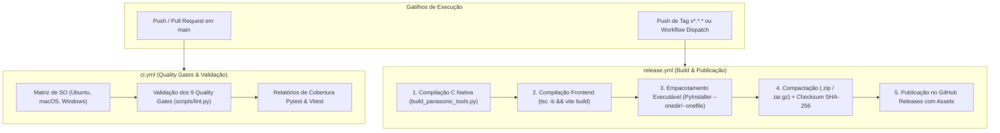

# 📦 Pipeline de Release, CI/CD & Empacotamento Multiplataforma

Este documento descreve detalhadamente o fluxo de Integração Contínua (CI) e Entrega Contínua (CD) do **VHS Studio Pro**, cobrindo o ciclo de testes automatizados, compilação de binários nativos em C, empacotamento desktop com PyInstaller e publicação de releases com integridade criptográfica.

---

## 1. Visão Geral dos Workflows (.github/workflows/)

O repositório possui dois workflows principais gerenciados via GitHub Actions:



---

## 2. Compilação Nativa de Utilitários em C (`build_panasonic_tools.py`)

Antes de gerar os executáveis do estúdio, os utilitários de baixo nível para recuperação do sistema de arquivos Panasonic DMR (`extract_meihdfs`, `dvd-vr`, `vro2split`) são compilados nativamente no ambiente do runner:

| Sistema Operacional | Compilador Utilizado | Flags de Otimização | Binários Gerados em `tools/panasonic_rec/` |
| :--- | :--- | :--- | :--- |
| **Windows (`windows-latest`)** | MinGW GCC / MSVC | `-O2 -s` | `extract_meihdfs.exe`, `dvd-vr.exe`, `vro2split.exe` |
| **Linux (`ubuntu-latest`)** | GNU GCC | `-O2 -s` | `extract_meihdfs`, `dvd-vr`, `vro2split` |
| **macOS (`macos-latest`)** | Apple LLVM / Clang | `-O2` | `extract_meihdfs`, `dvd-vr`, `vro2split` (Mach-O) |

O script [`scripts/build_panasonic_tools.py`](file:///c:/Users/danie/Documents/vhs-capture-scripts-main/scripts/build_panasonic_tools.py) detecta automaticamente o compilador instalado no ambiente e gera os binários executáveis com tratamento de erros.

---

## 3. Empacotamento do Frontend React (Node.js 24)

O frontend construído em **React 19, Vite, Tailwind CSS v4 e Lucide Icons** é compilado estaticamente:
```bash
npm --prefix ui ci
npm --prefix ui run build
```
- A variável `ACTIONS_RUNNER_FORCE_NODE24: "true"` é configurada no workflow para garantir compatibilidade com as ações modernas do GitHub Actions.
- O resultado do bundle estático gerado em `ui/dist/` é embutido no pacote do aplicativo para que a interface gráfica e o servidor web local operem de forma 100% offline, sem necessidade de Node.js instalado na máquina do usuário final.

---

## 4. Empacotamento com PyInstaller

O executável standalone é construído através do PyInstaller utilizando o arquivo de especificações e parâmetros de linha de comando:

```bash
pyinstaller --noconfirm --onedir --windowed \
  --name "vhs-studio-pro" \
  --add-data "ui/dist${SEP}ui/dist" \
  --add-data "tools/panasonic_rec${SEP}tools/panasonic_rec" \
  --add-data "src/vhs_studio${SEP}vhs_studio" \
  src/vhs_studio/cli/main.py
```
*Onde `${SEP}` é o separador de caminhos do sistema operacional (`;` no Windows e `:` no Linux/macOS).*

### Inclusão de Dados Críticos:
- `ui/dist`: Contém todos os assets HTML/CSS/JS e traduções i18n pré-compiladas.
- `tools/panasonic_rec`: Contém os binários C compilados para o sistema operacional em execução.
- `vhs_advanced_config.toml`: Contém as definições de presets e filtros de referência.

---

## 5. Verificação Criptográfica de Integridade (SHA-256)

Para garantir máxima segurança aos usuários e evitar adulterações de pacotes em trânsito:
1. Cada artefato compactado (`vhs-studio-pro-windows-x64.zip`, `vhs-studio-pro-linux-x64.tar.gz`, `vhs-studio-pro-macos-x64.zip`) tem seu hash criptográfico SHA-256 gerado automaticamente:
   ```bash
   sha256sum vhs-studio-pro-windows-x64.zip > vhs-studio-pro-windows-x64.zip.sha256
   ```
2. O arquivo de checksum é publicado como asset complementar no release do GitHub.
3. O operador pode auditar e verificar o download com um único comando:
   ```bash
   # Windows (PowerShell)
   Get-FileHash vhs-studio-pro-windows-x64.zip -Algorithm SHA256

   # Linux / macOS
   sha256sum -c vhs-studio-pro-linux-x64.tar.gz.sha256
   ```

---

## 6. Como Disparar um Release

1. **Via Tag Git:**
   ```bash
   git tag -a v2.5.0 -m "Release v2.5.0: Panasonic Hotplug MEIHDFS & A/B Monitor"
   git push origin v2.5.0
   ```
2. **Via Interface Web (GitHub Actions):**
   - Acesse a aba **Actions** no repositório GitHub.
   - Selecione o workflow **Release & Distribution**.
   - Clique em **Run workflow**, selecione o branch e digite a versão desejada (ex: `v2.5.0`).
   - O workflow construirá os 3 pacotes de SO em paralelo e publicará a release com notas de versão geradas automaticamente.
